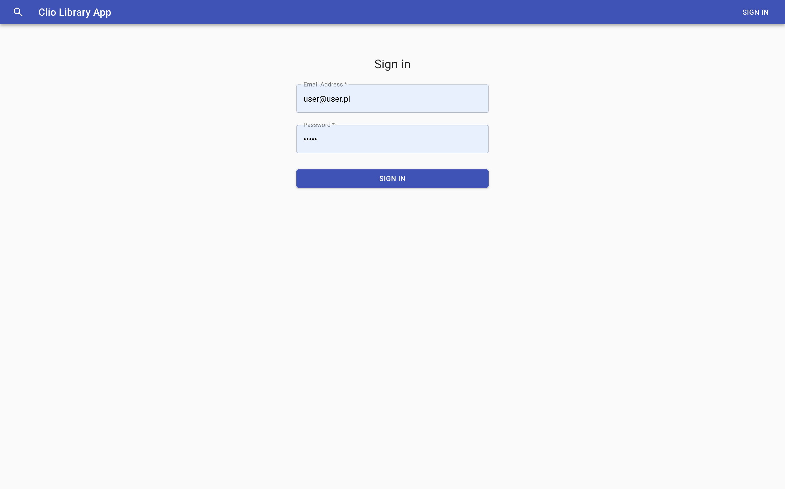
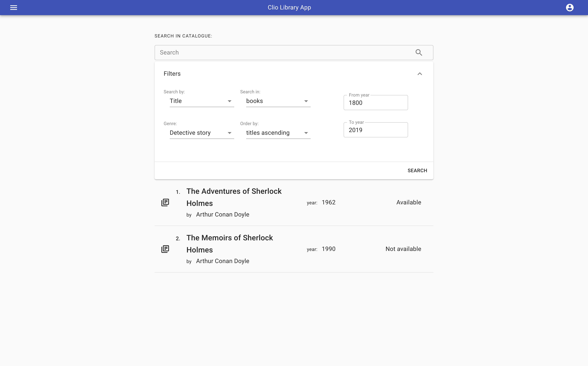
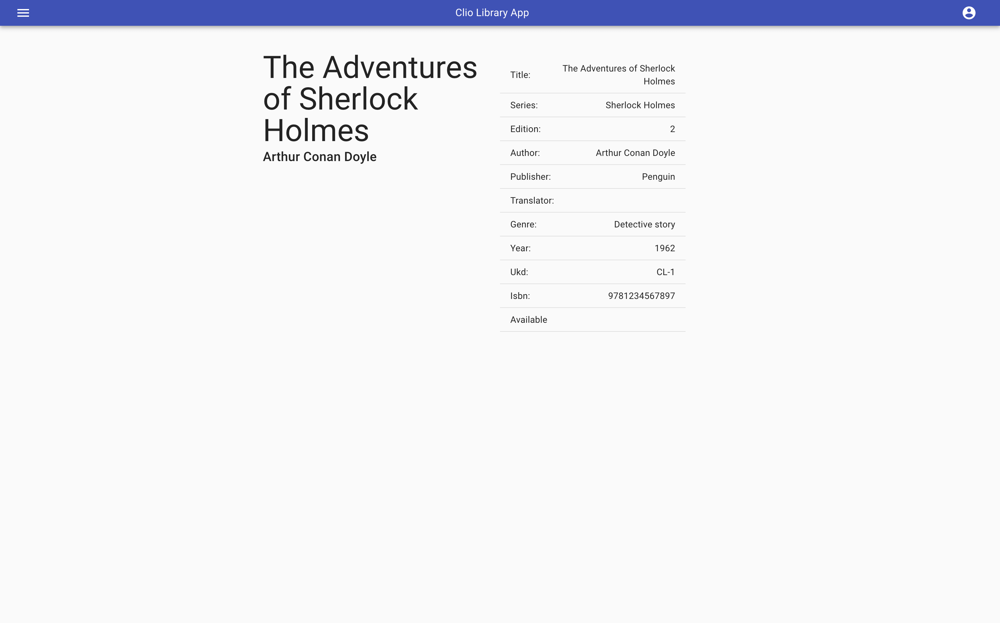
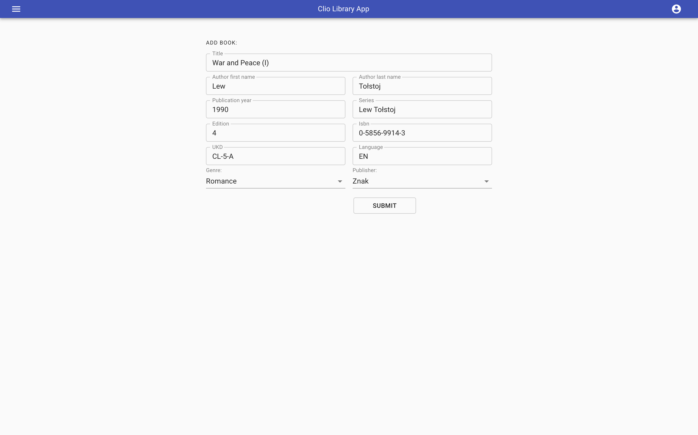
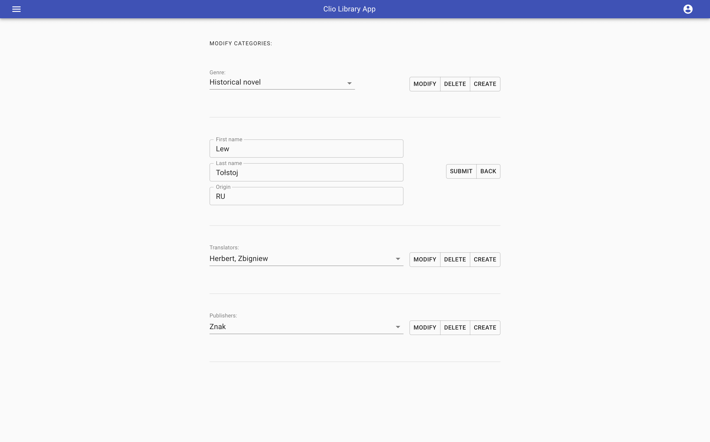
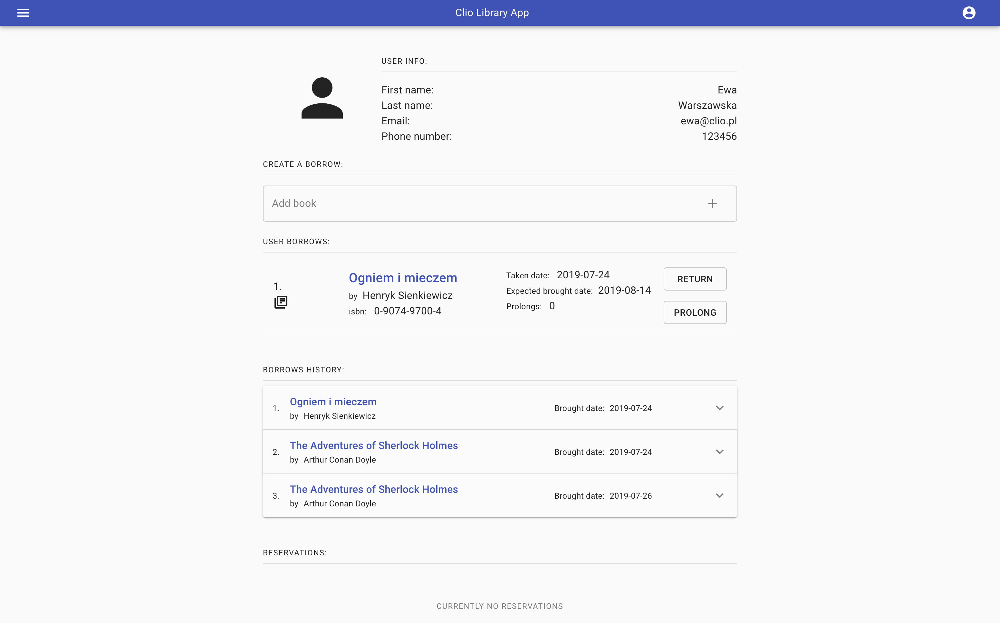
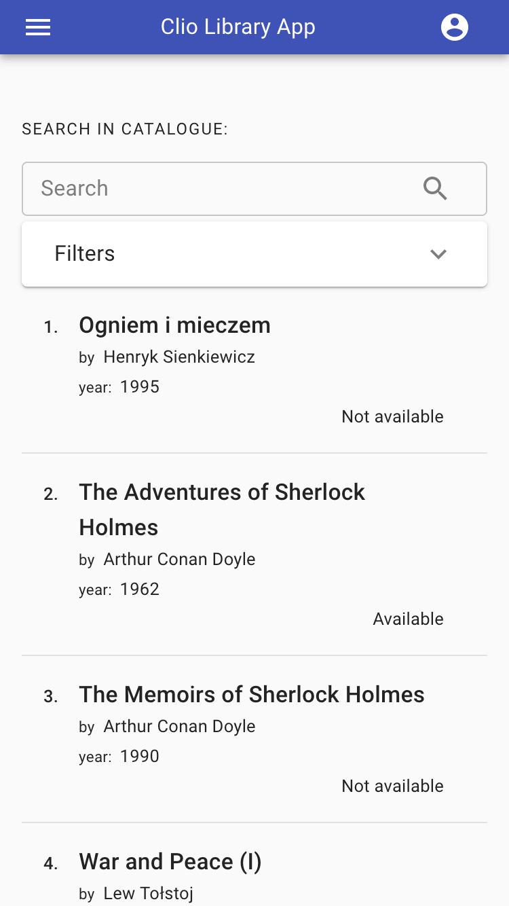

# Clio
> Library app

Simple UI library app for searching and managing books.

The name is inspired by the Greek muse of history - "Clio".
She is often represented with an open parchment scroll, a book, or a set of tablets.

## Live 
https://clio-library.herokuapp.com/
> Notice: The app is hosted on Heroku, so the initial load may take some time. Please, give it a few seconds.

## Guide
Usage is easy!

If you want to log as ADMIN, sign in with those  credentials:
```
email address: admin@admin.pl
pass: 12345
```

If you want to log as USER, use these:
```
email address: user@user.pl
pass: 12345
```

Accessing books and users borrows from ADMIN account is possible by finding ID only.</br> ID would be displayed on the book's etiquette or on the user's card, so here are some example IDs:

>Just start typing and suggestions will be displayed simultaneously.

User IDs
```
73529347-ba21-4c2e-a798-29ffc9d30b8d
605b6035-357f-406f-8b46-8060bba60100
09a43d7a-a013-4c6e-8031-14e4517e7d3b
```
Book IDs
```
2401068f-94ae-488c-972f-d433b915df9a
b46d3c35-f83d-4d96-9b66-0f9daa4d39a6
caa393ed-f288-47b0-abff-7ce37c1ea759
```

You can also obtain book ID entering search detail for a book. ID is the last element in the URL's path.
## About

Clio is a full feature librarian app with user authorization system providing access for registered users, librarians and unregistered guests.
It consists of React client, Express Rest API and PostgreSQL DB.

Made as a project to train my skills in constructing Rest APIs and working with relational databases.
Also I wanted to make full grown application as an autonomous entity.

## Features
- Made with Material-UI components to create simple intuitive interface
- Fully responsive user interface
- App provides all CRUD operations
- Authorization made using Json Web Token with separate routes for: admin, registered user and guest
- Sensitive data such as passwords is secured with hash algorithms
- Advanced search panel with filters 
- API's routes secured with JWT middleware utility
- auto-suggest when searching ID of a book or a user

###### Admin's privileges
- full access to search for books with filters
- create/modify/delete books 
- create/modify/delete categories
- create users
- borrow/prolong/return operations on user's account
- search for books with ID
- search for users with ID
###### User's privileges
- full access to search for books with filters
- reserve a book (max for 5 days), CRON operation checks for passed reservations every 6 hours
- cancel reservation
- prolong a already borrowed book (max 3 times)
- view all borrows, past borrows and reservations
###### Guest's privileges
- full access to search for books with filters

----


> ##### Future features 
> 
> This project is created for learning purposes only. It gives basic functionality as it is.
> 
> It would be nice to have more features though, like:
>
> - punishment system for overdue books ( fines system )
> - user notification ( overdue books, reservations, fines, general library announcements)
> - more filter search options
> - scan ID with barcode scanner
> - generating etiquette with barcode for newly added book or for new user's card
> - better bundle optimization with code-splitting, webpack chunks i.e

## Stack
##### Front-end
- React
- Redux
- Material-UI 
##### Back-end
- Node
- Express
##### Database
- SQL (PostgreSQL)
##### Tools & noticeable dependencies
- Webpack
- Babel
- Axios
- jsonwebtoken
- bcrypt
- js-cookie
- moment.js
- pg ( Node PostgreSQL driver )
- formik
- yup
- react-router


## Screenshots
</br>
<sup>Sign in</sup> </br>


</br>
<sup>Search and current user info</sup> </br>


</br>
<sup>Search with filters</sup> </br>


</br>
<sup>Detail result</sup> </br>


</br>
<sup>Adding book</sup> </br>


</br>
<sup>Modify categories</sup> </br>


</br>
<sup>User stats</sup> </br>


</br>
<sup>Responsive search</sup> </br>



## Links

- Live: https://clio-library.herokuapp.com/
> Notice: The app is hosted on Heroku, so the initial load may take some time. Please, give it a few seconds.
- Repository: https://github.com/EmilTheSadCat/clio-library-app


## Licensing

The code in this project is licensed under ISC license.
